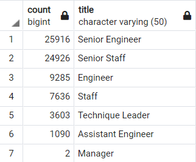
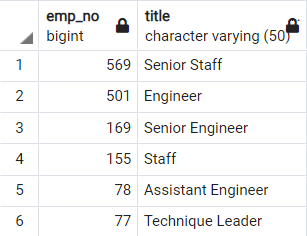
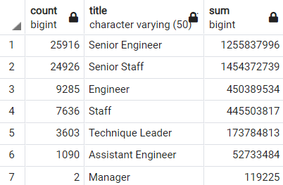

# Pewlett-Hackard-Analysis

## Overview of the Analysis

This analysis aims to determine the number of retiring employees per title, and identify employees who are eligible to participate in a mentorship program. 

## Results

* The total number of retiring employees is 72,458. 
* Senior Engineer is the position with the highest number of retiring employees.
* The following table displays the number of employees retiring per position

* The total number of employees who are eligible to participate in mentorship program is 1,549.
* Senior Staff is the position with the highest number of eligible mentors.
* The following table displays the number of employees eligible for mentorship per position
* 

## Summary 
* How many roles will need to be filled as the "silver tsunami" begins to make an impact?
The total number of roles to be filled is 72,458, as the number of roles to be filled is the same as the number of retiring employees.

* Are there enough qualified, retirement-ready employees in the departments to mentor the next generation of Pewlett Hackard employees?

The only positions that have enough mentors to train the new employees is Assitant Engineer and Engineer. As the number of new employees per mentor for the Assitant Engineer is 14 and the number of  new employees per mentor for Engineer position is 19. This seems to be a reasonable number of employees per mentor. 
However for the other positions the number of new employees per mentor is very high. 

The number of new employees per mentor for Senior Engineer position is 154, for Senior Staff 43, for Staff is 50, for Techinque Leader 47 and there are no eligible mentors for the Manager position.

* The budget needed to pay the salaries of the new employees per positions is shown in the next table:

As we can see, the highest budget is needed for the Senior Staff position. And the lowest budget, for the Manger position. 
